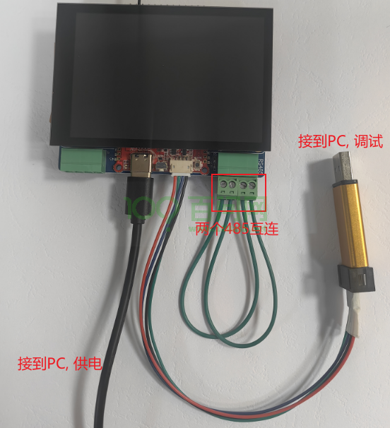
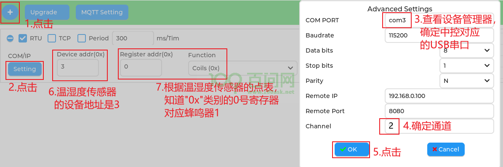
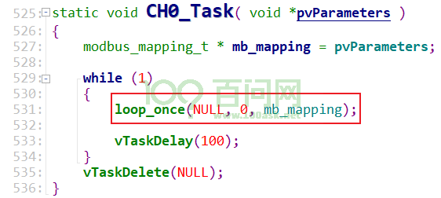
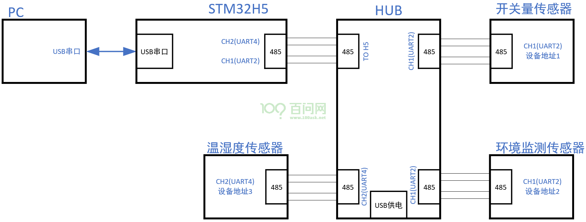
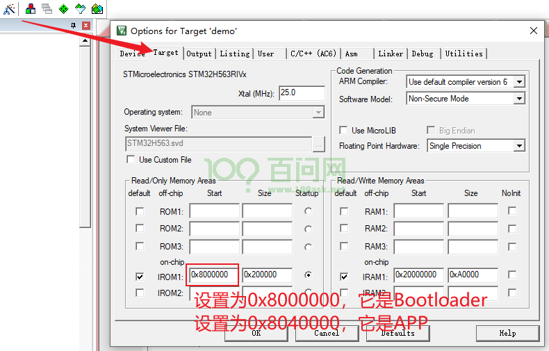
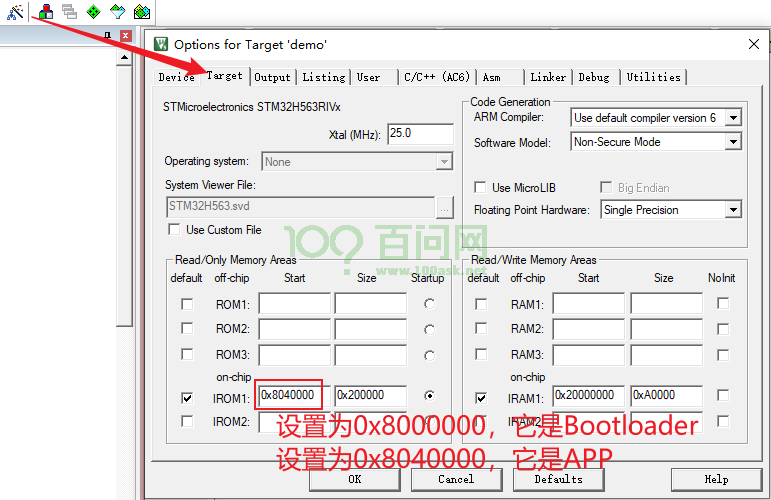
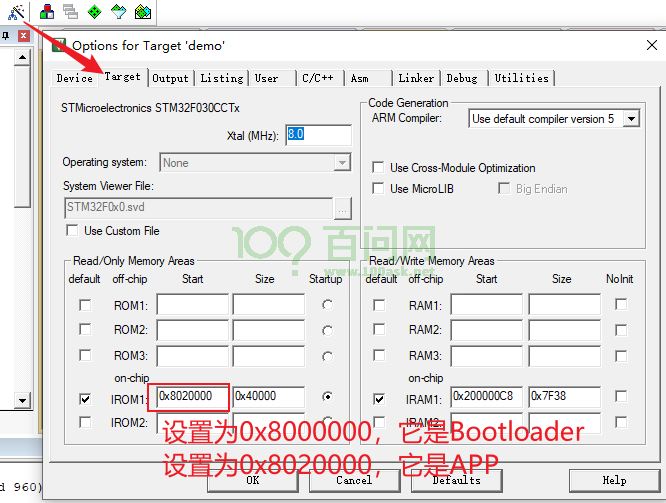
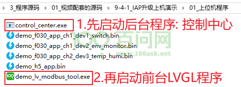
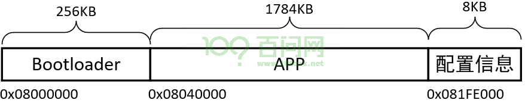

# 第9章 综合实现

本章课程将根据上位机的接口规范，编写主控、传感器的综合程序：让上位机能读写传感器、升级主控程序、升级传感器程序。

## 9.1 产品框架

### 9.1.1 硬件框架

 

### 9.1.2 设计思路

#### **1. 上位机如何定位到传感器**

站在上位机的角度，以“Modbus传感器2为例”，上位机需要通过com1、channel1发出Modbus数据包，数据包里含有“设备地址”、“寄存器类别”、“寄存器地址”。所以，上位机需要确定这几个参数：

- 串口：com1还是com2，或其他
- 通道：channel1还是channel2？可以使用channel0表示连接在主控上的设备
- Modbus设备地址
- Modbus设备的寄存器类别
- Modbus设备的寄存器地址

所以：在上位机的操作界面，增加一个“点”时，需要指定这5个参数。

#### **2. 上位机如何读写传感器**

为了简化上位机的实现，在上位机的角度，它“只看到”一个传感器：就是主控。上位机读写主控的寄存器时，主控会去读写其他传感器。这有一个“映射”：主控的寄存器，映射到channel0、1、2的其他设备的某个寄存器。当上位机增加“点”时，上位机会得到用户设置的“5个参数”，它会利用这些参数创建映射关系，并且发给中控。

#### **3. 中控如何读写传感器**

中控程序得到上位机发来的“映射”信息后：

- 读操作：中控不断地读取传感器的某个点的数值，以备上位机读取。
- 写操作：中控等待上位机发来的写命令，根据这些写命令去写传感器。

#### **4. 上位机如何发送映射关系、传输固件**

Modbus里有“Write File Record”功能，可以使用它来发送大量数据、发送文件。

#### **5. 上位机界面**

 

### 9.1.3 软件框架

 

## 9.2 改造libmodbus实现文件传输

### 9.2.1 分析Write File Record功能

想想这个场景，你要发出多个文件，每个文件还都很大，那么必然就是分块发送：

- 当前发送的是哪个文件？数据包里有“File Number”
- 当前发送的是第几个数据包？数据包里有“Record Number”
- 当前发送的数据包多大？数据包里有“Record length”
- 数据本身

“Write File Record”的请求格式如下：

 

“Write File Record”的回应跟请求包一模一样。

### 9.2.2 实现Write File Record

本节源码为“3_程序源码\01_视频配套的源码\ 9-2-2_实现Write_File_Record\h5_write_file_record”。

本节程序，在“3_程序源码\01_视频配套的源码\7-15_增加容错代码\h5_demo.7z”d的基础上修改而来。

本节要实现2个功能：

- 改造libmodbus，增加“Write File Record”功能
- 测试：
  -  H5开发板的UART2连接到UART4
  - 任务1通过channel1（即UART2）发出“Write File Record”数据包
  - 任务2通过channel2（即UART4）得到“Write File Record”数据包，验证无误后再LCD显示结果

按照下图连线：调试、供电、两个485互连：

 

### 9.2.3 UART驱动严重Bug

本节源码为“3_程序源码\01_视频配套的源码\9-2-3_UART驱动严重Bug\h5_uart_dma_ok.7z”。

我们使用“HAL_UARTEx_ReceiveToIdle_DMA”来启动UART数据的接收，假设传入的数据长度是100。当数据接收完毕，或者发生了Idle中断时，“HAL_UARTEx_RxEventCallback”函数被调用。但是！除了这两种情况之外，当接收到一半数据时，这个函数也会被调用。

在以前的代码里，我们误认为“数据全部接收完毕”、“发生Idle中断”时，才会调用“HAL_UARTEx_RxEventCallback”。在里面，我们认为数据接收完毕，于是再次启动DMA传输。这会导致在接收到一半数据、触发“HAL_UARTEx_RxEventCallback”调用时，我们也再次启动DMA传输，导致数据丢失。

正确的“HAL_UARTEx_RxEventCallback”函数代码如下：

 

```c
void HAL_UARTEx_RxEventCallback(UART_HandleTypeDef *huart, uint16_t Size)
{
    PUART_Data pdata;
    static uint16_t old_pos;
    
    if (huart == &huart2)
    {
        pdata = &g_uart2_data;
    }
    if (huart == &huart4)
    {
        pdata = &g_uart4_data;
    }
    
    /* write queue : g_uart4_rx_buf Size bytes ==> queue */
    for (int i = old_pos; i < Size; i++)
    {
        xQueueSendFromISR(pdata->rxQueue, (const void *)&pdata->rx_buf[i], NULL);
    }

    old_pos = Size;

    if (huart->RxEventType != HAL_UART_RXEVENT_HT)
    {
        old_pos = 0;
        
        /* re-start DMA+IDLE rx */
        HAL_UARTEx_ReceiveToIdle_DMA(pdata->huart, pdata->rx_buf, UART_RX_BUF_LEN);
    }
        
}
```

当使用libmodbus时，有两个超时时间需要仔细考虑（Middlewares\Third_Party\libmodbus\modbus-private.h）：

 

“_RESPONSE_TIMEOUT”是“等待回应的时间”：client给server发出请求后，client要等待server发出的回应，这个等待时间要设置得比较大，以便server有足够的时间处理数据并发出回应。

“_BYTE_TIMEOUT”是“等待后续数据的时间”：一旦得到回应的第一个数据后，后续的数据应该是连续不断地来到，所以后续的超时时间可以设置得比较小(比如设置为modbus协议规定的3.5个字节时长)。但是，对于DMA传输要特殊考虑。

当使用DMA方式接收数据时，DMA可以及时地把串口接收到的数据存入内存，但是它无法及时通知应用程序：假设启动DMA传输来读取256字节(modbus rtu最大数据包)数据，当读取到一半数据即128字节的数据时才会触发“Half Transfer”的回调，这时才会通知应用程序。所以，使用libmosbus等待回应时，超时时间要设置得比较大，不仅要大于接收完128字节数据的时间，也要考虑：留更多的时间给对方，以便它有足够的时间处理数据然后回复。

当应用程序读取到第一个回应的数据后，以后再读取后续数据时，超时时间如何设置？假设client等待回应后得到了一半的数据共128字节，它需要等待多久才可以得到第129个字节数据？DMA很快得到第129个数据，但是要等待剩余数据全部接收完毕，这时才会发生中断，应用程序才被通知到。得到回应之后（接收到一半的数据之后），DMA传输完成还需要一半数据的时间，以波特率115200为例，需要128x10/115200=11.1ms。所以，使用libmosbus传输比较大的回应数据时，xxx超时时间设置为10ms是不够的，为了保险，我们可以设置为20ms。

修改后的代码如下：

 

### 9.2.4 实现文件传输

本节源码为“3_程序源码\01_视频配套的源码\9-2-4_实现文件传输\h5_write_file”。

对于“Write File Record”功能，它仅仅传输“一小块”数据，接收方无法从“这一小块”数据里知道“文件总大小”等信息。文件传输的功能需要我们自己实现：

- Client：使用文件名、文件大小，构造出Record Number为0的数据包，发送出去

这个数据包的格式为：

```c
typedef struct FileInfo {
    uint32_t version;
    uint32_t file_len;
    uint32_t load_addr;
    uint32_t crc32;
    uint8_t file_name[16];
}FileInfo, *PFileInfo;
```

- Server：收到这个数据包后，就可以从中知道文件名、文件大小等信息
- Client：就可以把文件内容拆分为多个Record，发送出去
- Server：接收到数据包后，根据Record Number组装数据

## 9.3 读写任意传感器

### 9.3.1 上机演示

#### **1. 接线**

如下图连线，H5控制板使用USB线供电，中间的HUB也使用USB供电：

 

连接示意图为：

 

**注意**：三个传感器的启动开关都拨到“ON”位置。

#### **2. 烧写程序**

先烧写中控（H5开发板），工程为“3_程序源码\01_视频配套的源码\9-3-1_读写任意传感器上机演示\02_中控程序\h5_read_write_with_map.7z”。

再分别烧写三个传感器，工程为“3_程序源码\01_视频配套的源码\9-3-1_读写任意传感器上机演示\03_传感器程序\f030_demo.7z”。

注意：f030_demo需要分别设置下面的宏（这3个宏同一时间只能定义一个），编译出程序后分别烧写到3个传感器里。

```c
#define USE_SWITCH_SENSOR 1
#define USE_ENV_MONITOR_SENSOR 1
#define USE_TMP_HUMI_SENSOR 1
```

#### **3. 使用**

先启动上位机：

 

再增加、设置“点”。

比如要操作接在CH2上的温湿度传感器的蜂鸣器1，如下设置：

 

比如要操作中控（H5开发板自带的LED），如下设置：

 

**注意**：

- 在上位机里进行设置时，无法使用实体键盘（LVGL前台程序使用键盘有点难度），需要使用它弹出的虚拟键盘。
- 为了有空间显示虚拟键盘，当前要设置的“点”，会自动移到屏幕的最上面。

最后就可以读写点了，比如：

 

### 9.3.2 使用“点”的映射表操作任意传感器的原理

在《7.7.2 上位机访问多个传感器》曾经讲解过“点”的映射，它使用固定的映射表。本节课程将使用更加灵活的、随时可变的映射表。

上位机要读写传感器，需要中控进行转发。在上位机的角度，它只看到中控、只是读写中控的寄存器。中控需要“帮助”上位机去读写下挂的传感器。这里存在“点”的映射关系：上位机要读写的主控的“点”，怎么跟具体传感器的“点”对应。

使用“点”的映射信息，有3个问题要解决:

#### **1. 怎么表示映射关系**

使用如下结构体表示一个点的映射关系：

```c
typedef struct PointMap {
    char reg_type[4];
    uint16_t reg_addr_master; /* 主控的寄存器地址 */    
    uint16_t channel;         /* 0-主控本身, 1-通过CH1访问, 2-通过CH2访问 */
    uint16_t dev_addr;        /* 传感器的设备地址 */
    uint16_t reg_addr_salve;  /* 传感器的寄存器地址 */
}PointMap, *PPointMap;
```

主控根据这样的结构体，就知道：上位机想读写“reg_type”类型的“reg_addr_master”寄存器时，实际上是想读写“channel通道上、设备地址为dev_addr的reg_type类型的reg_addr_slave”寄存器。

上位机会把多个“PointMap”发给中控，中控要记录这些结构体。

#### **2 怎么发送映射关系**

使用modbus_write_file发送file_no为0的数据。

#### **3. 中控如何处理映射关系**

中控创建4个任务：

- USB串口任务：用于实现USB串口
- LibmodbusServerTask：跟PC进行通信，接收上位机发来的“点”的映射表；根据上位机的读写请求操作DI/DO/AI/AO寄存器
- CH0_Task：中控上有CH1、CH2，分别对应2个RS485接口。我们引入CH0，表示要读写中控板子自带的传感器（比如LED）。
- CH0_Task有2个功能：
  - 根据映射表，读取中控本身的传感器，更新DI/DO/AI/AO寄存器
  - 当映射表里channel 0对应的DO/AO寄存器发生变化时，用来设置中控本身的传感器
- CH1_Task：它有2个功能
  - 根据映射表，读取channel 1的传感器，更新DI/DO/AI/AO寄存器
  - 当映射表里channel 1对应的DO/AO寄存器发生变化时，用来设置对应的传感器
- CH2_Task：它有2个功能
  - 根据映射表，读取channel 2的传感器，更新DI/DO/AI/AO寄存器
  - 当映射表里channel 2对应的DO/AO寄存器发生变化时，用来设置对应的传感器

 

### 9.3.3 中控代码讲解

讲解“3_程序源码\01_视频配套的源码\9-3-1_读写任意传感器上机演示\02_中控程序\h5_read_write_with_map.7z”。

要讲解的代码，都在“Core\Src\control.c”里。

#### **1.LibmodbusServerTask任务**

它有2个功能：

- 跟PC进行通信，接收上位机发来的“点”的映射表；
- 根据上位机的读写请求操作DI/DO/AI/AO寄存器

代码如下：

 

#### **2. CH0_Task任务**

它有2个功能

- 根据映射表，读取中控本身的传感器，更新DI/DO/AI/AO寄存器
- 当映射表里channel 0对应的DO/AO寄存器发生变化时，用来设置中控本身的传感器

代码如下：

 

#### **3. CH1_Task、CH2_Task任务**

它们功能类似，都有2个功能

- 根据映射表，读取channel 1或channel 2的传感器，更新DI/DO/AI/AO寄存器
- 当映射表里channel 1或channel 2对应的DO/AO寄存器发生变化时，用来设置对应的传感器

代码如下（以CH1_Task为例）：

 

#### **3. loop_once函数**

它是CH0_Task、CH1_Task、CH2_Task的主要函数，代码如下：

 

## 9.4 IAP升级

IAP是In Application Programming的首字母缩写，IAP是用户自己的程序在运行过程中对User Flash的部分区域进行烧写，目的是为了在产品发布后可以方便地通过预留的通信口对产品中的固件程序进行更新升级。

### 9.4.1 上机演示

#### **1. 接线**

如下图连线，H5控制板使用USB线供电，中间的HUB也使用USB供电：

 

连接示意图为：

 

**注意**：三个传感器的启动开关都拨到“ON”位置。

#### **2. 烧写H5 Bootloader程序**

先烧写中控（H5开发板），工程为“3_程序源码\01_视频配套的源码\9-4-1_IAP升级上机演示\02_中控程序\h5_iap.7z”。

注意：H5的BootLoader和APP是同一套代码，需要指定不同的ROM地址，如下设置即为Bootloader。

 

#### **3. 烧写传感器Bootloader程序**

分别烧写三个传感器的Bootloader，工程为“3_程序源码\01_视频配套的源码\9-3-1_读写任意传感器上机演示\03_传感器程序\f030_iap.7z”。

注意：传感器的BootLoader和APP是同一套代码，需要指定不同的ROM地址。

先如下设置ROM地址：

 

注意：f030_iap需要分别设置下面的宏（这3个宏同一时间只能定义一个），编译出程序后分别烧写到3个传感器里。

再修改“f030_ipa\demo\Core\Src\freertos.c”，定义宏开关：

```c
#define USE_SWITCH_SENSOR 1
#define USE_ENV_MONITOR_SENSOR 1
#define USE_TMP_HUMI_SENSOR 1
```

编译后，就可以分别烧录到对应的传感器。

#### **4. 编译H5 APP**

可以使用如下目录有事先编译好的APP：

 

也可以自己编译。工程为“3_程序源码\01_视频配套的源码\9-4-1_IAP升级上机演示\02_中控程序\h5_iap.7z”。

注意：H5的BootLoader和APP是同一套代码，需要指定不同的ROM地址，如下设置即为APP。

 

编译得到bin文件：demo_h5_app.bin。

最后，把bin文件放到上位机程序相同的目录下，这点很重要。由于LVGL的限制，目前只支持使用同目录下的文件。

#### **5. 编译传感器 APP**

可以使用如下目录有事先编译好的APP：

 

也可以自己编译。工程为“3_程序源码\01_视频配套的源码\9-4-1_IAP升级上机演示\03_传感器程序\f030_iap.7z”。

注意：传感器的BootLoader和APP是同一套代码，需要指定不同的ROM地址。

先如下设置ROM地址：

 

注意：f030_iap需要分别设置下面的宏（这3个宏同一时间只能定义一个），编译出程序后分别烧写到3个传感器里。

再修改“f030_ipa\demo\Core\Src\freertos.c”，定义宏开关：

```c
#define USE_SWITCH_SENSOR 1
#define USE_ENV_MONITOR_SENSOR 1
#define USE_TMP_HUMI_SENSOR 1
```

编译后，就可以得到“demo_f030_app.bin”。对于不同的传感器，可以把bin文件分别改名为：

```c
demo_f030_app_ch1_dev1_switch.bin
demo_f030_app_ch1_dev2_env_monitor.bin
demo_f030_app_ch2_dev3_temp_humi.bin
```

最后，把bin文件放到上位机程序相同的目录下，这点很重要。由于LVGL的限制，目前只支持使用同目录下的文件。

#### **6. 升级中控**

先启动上位机：

 

在界面上如下操作：

 

在上位机界面，可以看到升级进度：

 

在中控的LCD屏幕，在升级过程中显示“Bootloader”，升级完成后显示“Application”。

然后就可以按照《9.3.1 上机演示》使用中控了。

#### **7. 升级传感器**

先启动上位机：

 

在界面上如下操作：

 

在上位机界面，可以看到升级进度：

 

在中控的LCD屏幕，在升级过程中显示“Send file to sensor: record_no =”类似的打印信息。

升级完成后，可以看到传感器的三个LED亮起。然后就可以按照《9.3.1 上机演示》使用传感器了。

### 9.4.2 IAP升级的软件设计思路

#### **1. Flash划分**

对于中控，STM32H563RIV内置2MB Flash，划分如下：

- Bootloader占据256KB空间
- APP占据1784KB空间
- 配置信息占据最后一个扇区8KB空间：用来保存APP版本、大小、校验码等信息。

 

对于传感器，STM32F030CC内置256KB Flash，划分如下：

- Bootloader占据128KB空间
- APP占据126KB空间
- 配置信息占据最后一个扇区2KB空间：用来保存APP版本、大小、校验码等信息。

 

#### **2. 升级流程**

升级流程分为3个步骤：

- 上位机让目标板进入Bootloader

无论是中控还是传感器，它当前运行的程序可能是“Bootloader”或“APP”。要升级APP，必须让它进入Bootloader：

- 对于中控：上位机直接发命令给中控让它进入Bootloader

中控处于Bootloader的话则无需重启；中控处于APP的话，需要设置配置信息表明要进入Bootloader，然后软件复位；重启后运行的是Bootloader，它要根据配置信息保持在Bootloader。

- 对于传感器：上位机直接发命令给中控，中控再转发给传感器让它进入Bootloader

传感器处于Bootloader的话则无需重启；传感器处于APP的话，需要设置配置信息表明要进入Bootloader，然后软件复位；重启后运行的是Bootloader，它要根据配置信息保持在Bootloader。

注意：升级传感器时，中控要运行APP：它功能比Bootloader强大，可以更方便地操作传感器。

所以：要升级中控，中控要运行Bootloader。要升级传感器，中控要运行APP，传感器要运行Bootloader。

- 上位机发送固件、目标板接收到固件后烧录
- 上位机让目标板进入APP

当上位机发送完固件后，再给中控或传感器发送“启动APP”的命令。目标板就要设置配置信息表明要进入APP，然后软件复位；重启后运行的是Bootloader，它要根据配置信息启动APP。

上位机程序流程图如下：

 

中控和传感器的Bootloader程序流程图如下：

 

#### **3. 点表：增加命令寄存器**

无论是中控还是传感器，都需要接收“启动Bootloader”、“启动APP”的命令。可以增加一个点：地址为0，类型为“AO”（4x）。

- 写入0x55，表示“启动Bootloader”，即：让目标板进入Bootloader状态
- 写入0xAA，表示“启动APP”，即：让目标板进入APP状态

最新点表如下：

- 中控寄存器说明：

| 设备地址 | 寄存器地址 | 寄存器类别     | 用途                                      | 描述 |
| -------- | ---------- | -------------- | ----------------------------------------- | ---- |
| 01H      | 0000H      | DI             | 控制LED1                                  | 1-亮 |
| 0000H    | AO         | 升级命令寄存器 | 写入0x55：启动Bootloader写入0xAA：启动APP |      |

- 开关量模块（SWITCH）寄存器说明：

| 设备地址 | 寄存器地址 | 寄存器类别     | 用途                                      | 描述     |
| -------- | ---------- | -------------- | ----------------------------------------- | -------- |
| 01H      | 0000H      | DI             | 读取按键KEY1                              | 1-被按下 |
| 0001H    | DI         | 读取按键KEY2   | 1-被按下                                  |          |
| 0002H    | DI         | 读取按键KEY3   | 1-被按下                                  |          |
| 0000H    | DO         | 控制继电器1    | 1-吸合                                    |          |
| 0001H    | DO         | 控制继电器2    | 1-吸合                                    |          |
| 0002H    | DO         | 控制LED1       | 1-亮                                      |          |
| 0003H    | DO         | 控制LED2       | 1-亮                                      |          |
| 0004H    | DO         | 控制LED3       | 1-亮                                      |          |
| 0000H    | AO         | 升级命令寄存器 | 写入0x55：启动Bootloader写入0xAA：启动APP |          |

- 环境监测模块（ENV_MONITOR）寄存器说明：

| 设备地址 | 寄存器地址 | 寄存器类别     | 用途                                      | 描述 |
| -------- | ---------- | -------------- | ----------------------------------------- | ---- |
| 02H      | 0000H      | DO             | 控制蜂鸣器1                               | 1-响 |
| 0001H    | DO         | 控制蜂鸣器2    | 1-响                                      |      |
| 0002H    | DO         | 控制LED1       | 1-亮                                      |      |
| 0003H    | DO         | 控制LED2       | 1-亮                                      |      |
| 0004H    | DO         | 控制LED3       | 1-亮                                      |      |
| 0000H    | AI         | 读取光敏电压   | 0xfff对应3.3V12位精度                     |      |
| 0001H    | AI         | 可调电阻器电压 | 0xfff对应3.3V12位精度                     |      |
| 0000H    | AO         | 升级命令寄存器 | 写入0x55：启动Bootloader写入0xAA：启动APP |      |

- 温湿度模块（TEMP_HUMI）寄存器说明：

| 设备地址 | 寄存器地址 | 寄存器类别     | 用途                                      | 描述 |
| -------- | ---------- | -------------- | ----------------------------------------- | ---- |
| 03H      | 0000H      | DO             | 控制蜂鸣器1                               | 1-响 |
| 0001H    | DO         | 控制蜂鸣器2    | 1-响                                      |      |
| 0002H    | DO         | 控制LED1       | 1-亮                                      |      |
| 0003H    | DO         | 控制LED2       | 1-亮                                      |      |
| 0004H    | DO         | 控制LED3       | 1-亮                                      |      |
| 0000H    | AI         | 读取温度       | 单位0.1摄氏度16位有符号整数               |      |
| 0001H    | AI         | 读取湿度       | 单位0.1%RH16位有符合整数                  |      |
| 0000H    | AO         | 升级命令寄存器 | 写入0x55：启动Bootloader写入0xAA：启动APP |      |

#### **4. Bootloader软件设计**

Bootloader升级APP的流程步骤看起来很多，其实它就做3件事：

- 启动：

根据配置信息，决定保留在Bootloader还是启动APP。

- 处理启动命令：

处理接收到“进入Bootloader”的命令、或“进入APP”的命令。

- 处理文件块：

中控的Bootloader需要处理映射信息、固件信息。传感器只会接收到固件信息，只需要处理固件信息。

处理映射信息：对于接收到的“Write File Record”数据包，如果record_no为0则解析出文件大小；如果record_no不为0则用来记录映射表。

处理固件信息：对于接收到的“Write File Record”数据包，如果record_no为0则解析出文件大小；如果record_no不为0则用来烧录Flash。

#### **5. IAP要点及时序图**

要点有2个：

- 在升级中控APP时：

中控的Bootloader接收到文件块后，要马上烧录Flash，根据烧录结果再回复Modbus请求。这样，上位机每发出一个“Write File Record”，根据返回值就知道烧录是否成功，这样的程序结构简单。

- 在升级传感器APP时：

中控的APP接收到文件块后，要马上发给传感器，传感器的Bootloader接收到后，也要马上烧录Flash，根据烧录结果再回复Modbus请求给中控，中控再回复给上位机。这样，上位机每发出一个“Write File Record”，根据返回值就知道烧录是否成功，这样的程序结构简单。

对于上位机发来的启动命令，也是一样的：

- 目标是中控的话，中控回复给上位机后要马上执行这些命令（先回复的原因是：执行重启命令的话，就无法回复了）。
- 目标是传感器的话，中控也要马上发送给传感器，确定传感器执行命令后，再回复给上位机。

上位机升级中控程序时，时序图如下：

 

上位机升级传感器程序时，时序图如下：

 

### 9.4.3 中控Bootloader代码讲解

中控代码为“3_程序源码\01_视频配套的源码\9-4-1_IAP升级上机演示\02_中控程序\h5_iap.7z”

#### **1. Bootloader启动判断**

读取配置信息，决定是否启动APP：

- 如果配置信息无效，则保持在Bootloader
- 如果配置信息明确表示要启动APP，则启动APP

代码在“h5_iap\demo\Core\Src\main.c”，如下：

 

启动APP的关键在于：

- 设置VTOR寄存器，重新指定异常向量表的位置为APP在Flash上的位置
- 读取APP异常向量表的第1个数据，把它写入SP寄存器
- 读取APP异常向量表的第2个数据，跳转执行
- 注释掉APP里设置VTOR的代码（它默认使用地址0），参考《8.2.3 编写APP》

前3点代码在“h5_iap\demo\Core\Src\jump.S”，如下：

 

#### **2. 处理启动命令**

代码在“h5_iap\demo\Core\Src\control.c”，如下：

 

“process_emergency_cmd”函数在“h5_iap\demo\Core\Src\control.c”，代码如下：

 

怎么启动Bootloader呢？先写配置信息，再软件复位。代码在“h5_iap\demo\Core\Src\bootloader.c”：

 

怎么启动APP呢？先写配置信息，再软件复位。代码在“h5_iap\demo\Core\Src\bootloader.c”：

 

#### **3. 处理文件块（Write File Record）**

代码在“h5_iap\demo\Core\Src\control.c”，如下：

 

“process_file_record”函数在“h5_iap\demo\Core\Src\control.c”，代码如下：

 

对于“给主控烧写固件”，分为2步：

- 得到record_no为0的文件头：记录文件大小、擦除Flash
- 得到record_no不为0的文件块：烧录Flash、最后写配置信息

 

### 9.4.4 传感器Bootloader代码和中控APP代码讲解

Bootloader代码为“3_程序源码\01_视频配套的源码\9-3-1_读写任意传感器上机演示\03_传感器程序\f030_iap.7z”。

中控代码为“3_程序源码\01_视频配套的源码\9-4-1_IAP升级上机演示\02_中控程序\h5_iap.7z”

#### **1. Bootloader启动判断**

读取配置信息，决定是否启动APP：

- 如果配置信息无效，则保持在Bootloader
- 如果配置信息明确表示要启动APP，则启动APP

代码在“f030_iap\demo\Core\Src\main.c”，如下：

 

启动APP的关键在于：

① 重定位异常向量表：

STM32F030CC没有VTOR寄存器，无法通过修改它指定异常向量表，它的异常向量表永远在地址0。但是可以设置一个寄存器，地址0映射到Flash（0x08000000）或内存（0x20000000）。

运行Bootloader时，地址0默认就是映射到Flash（0x08000000），无需设置。

Bootloader启动APP时，要把地址0映射到内存（0x20000000），代码在“f030_iap\demo\Core\Src\jump.S”，如下：

 

② 读取APP异常向量表的第1个数据，把它写入SP寄存器
③ 读取APP异常向量表的第2个数据，跳转执行

第②③点代码在“f030_iap\demo\Core\Src\jump.S”，如下：

 

那么，传感器的程序就不要使用内存前面的区域，如下设置：

 

#### **2. 处理启动命令**

代码在“f030_iap\demo\Core\Src\freertos.c”，如下：

 

“process_emergency_cmd”函数在“f030_iap\demo\Core\Src\control.c”，代码如下：

 

怎么启动Bootloader呢？先写配置信息，再软件复位。代码在“f030_iap\demo\Core\Src\bootloader.c”：

 

怎么启动APP呢？先写配置信息，再软件复位。代码在“f030_iap\demo\Core\Src\bootloader.c”：

 

#### **3. 处理文件块（Write File Record）**

代码在“f030_iap\demo\Core\Src\freertos.c”，如下：

 

“process_file_record”函数在“f030_iap_iap\demo\Core\Src\control.c”，代码如下：

 

对于烧写固件，分为2步：

- 得到record_no为0的文件头：记录文件大小、擦除Flash
- 得到record_no不为0的文件块：烧录Flash、最后写配置信息

 

#### **4. 中控APP要点**

中控代码为“3_程序源码\01_视频配套的源码\9-4-1_IAP升级上机演示\02_中控程序\h5_iap.7z”。

升级传感器程序时，上位机发来的命令、文件，通过中控转发给传感器，传感器处理后，再回复中控，中控再回复给上位机。

整个流程非常长，需要尽快处理！要点有2个：

- 中控接收到命令、“Write File Record”时，要马上处理，等待处理结果，返回给上位机
- 中控里其他读写传感器的任务，要暂时阻塞

中控马上处理收到命令、“Write File Record”，代码在“h5_iap\demo\Core\Src\control.c”，而不是交给其他任务来处理（读写一般寄存器时，时让其他任务处理的）。如下：

 

怎么阻塞其他任务？代码在“h5_iap\demo\Core\Src\control.c”，如下：

 