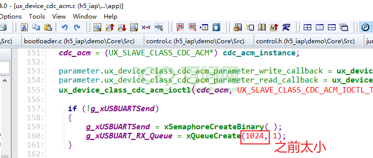
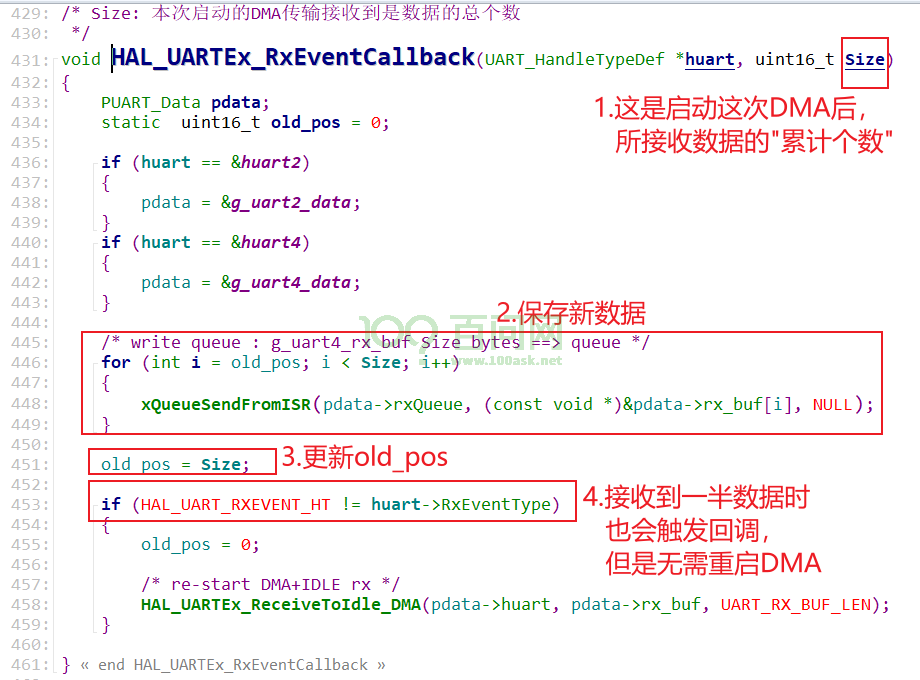

# 第10章 调试心得

#### **1. USB串口重复打开、关闭**

使用USB串口时，PC上如果中途关闭再打开串口，则开发板无法继续上报数据。解决方法为：

 

#### **2. USB串口数据丢失**

buffer不够大

 

#### **3. STM32 DMA接收回调函数**

 

#### **4. c++创建线程使用局部变量**

后台程序里创建线程时，使用局部变量。当创建函数退出后，局部变量被释放，线程有时候能运行，有时候崩溃。

 

#### **5. libmodbus使用DMA串口时超时时间的设置**

参考《9.2.3 UART驱动严重Bug》。

#### **6. F030改用DMA后栈溢出导致切换到timer任务时崩溃**

在PendSV里切换任务时：保存StartDefaultTask的现场时，会破坏timer任务的现场，当切换到timer任务时就崩溃了。

 

 

 

 