# 第7章 低成本 Modbus 传感器的实现

## 7.1 硬件资源介绍与接线

我们的 Modbus 传感器开发套件共有三个， 三个板子的使用的主控方案是 STM32F030芯片，硬件接口资源如下图所示：

 

开关量模块

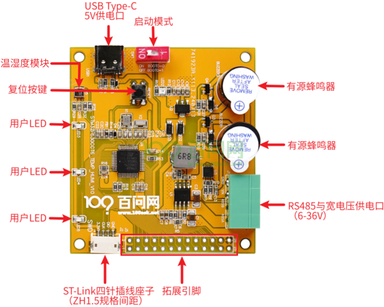 

温湿度变送器模块

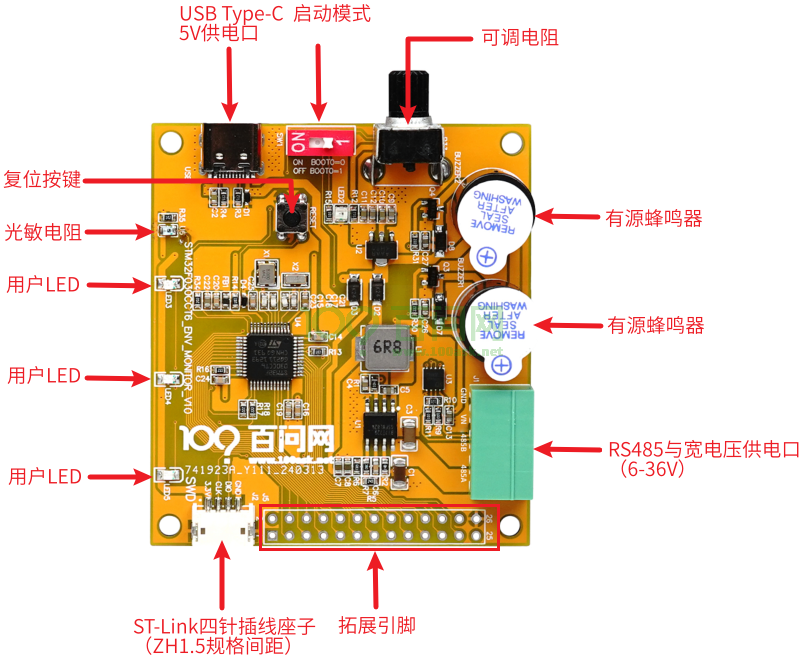 

环境检测模块

## 7.2 开发环境搭建

在前面我们已经安装了 Keil MDK、STM32CubeMX、STM32CubeProgrammer、ST-Link 驱 动、 CH340 驱动。因此在这里我们只需给 Keil MDK 安装 STM32F030 对应的 PACK 即可对改 芯片进行编码开发。

安装 PACK 的方法有两种：

- 第一种方法：双击运行开发板配套资料中的 Pack 安装包，随后弹出安装界面，按照默 认选项进行安装即可。：

 

- 第二种方法，在线安装， 下面演示如何在线安装。

打开Keil之后， 点击如下按钮启动“Pack Installer”：


使用 “Pack Installer” 可 以 方 便 的 对 Pack 安 装 和 管 理 。 在 左 上 角 搜 索 框 输 入 “STM32F030”，展开搜索结果，可以看到STM32F030CC，点击右边的简介链接即可跳转 到Pack下载页面，如下图所示。

 

如果跳转网页无法打开，可直接打开 Pack 下载总入口（www.keil.com/dd2/Pack/）。 进入 Pack 下载总入口后，搜索“STM32F030”，找到“STM030CCT”点击, 如下图所示（实 测部分网络环境打开该链接无 Pack 列表，请尝试换个网络环境测试，仍旧不行则使用配 套资料 Pack）。 

 

点击会跳转到 pack 包界面，点击右上角的”STM32F0xxDFP“即可跳转到 pack 包下载界面，点击右上角”STM32F0xxDFP“处即可下载 pack 包，如下图所示。

 


下载完成得到“Keil.STM32F0xx_DFP.2.1.1.pack”，直接双击该文件，随后弹出安装界 面，按照默认选项进行安装即可。

## 7.3 创建与体验第 1 个工程

### 7.3.1 创建工程

启动 STM32CubeMX 后，点击如下图标开始选择 MCU：

 

如下图输入型号“STM32F030CCT”，双击找到的芯片， 开始创建工程：

 

调高 CPU 频率：

 

配置工程， 如下操作：

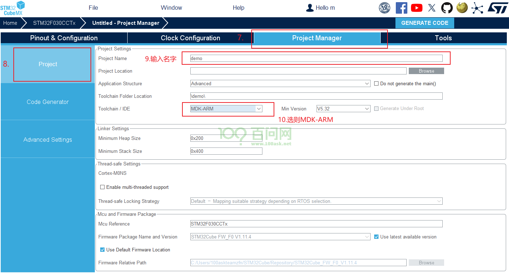 

指定代码生成方法， 如下： 

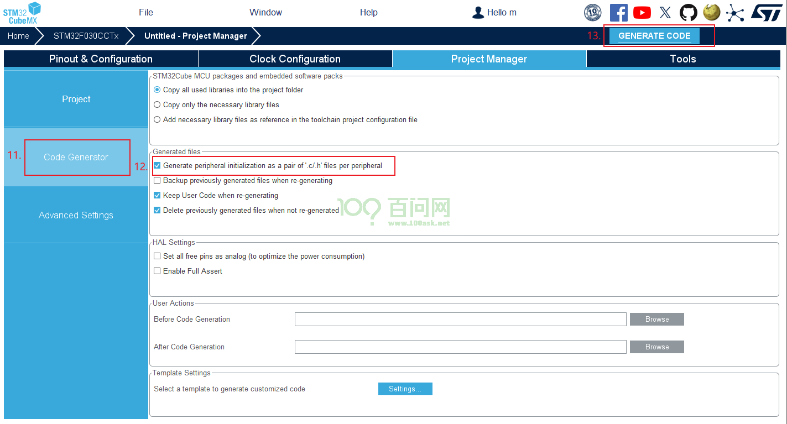 

### 7.3.2 配置调试器

新建的工程要配置调试器，参考[《2.2.3 配置调试器》 。](#bookmark1)

然后就可以编译程序、烧写运行了。

### 7.3.3 配置 GPIO 操作 LED

打开位于“5_硬件资料\01_开发板原理图\STM32F030CCT6_SWITCH_V11.pdf”的原理图 文件。

根据开发板原理图可以看到 F030的LED 引脚图如下：

 

可以双击打开工程中如下文件进入STM32CubeMX进行配置： 

 

然后如下配置 PB11 、PB12 、PB13 为输出引脚：

 

点击右上角的 “GENERATE CODE”按钮后打开工程。

在main函数的循环里， 增加如下代码：

```c
/* Infinite loop */
/* USER CODE BEGIN WHILE */
while (1)
{
    /* USER CODE END WHILE */
    /* USER CODE BEGIN 3 */
    /* set LED output high */
    HAL_GPIO_WritePin(GPIOB, GPIO_PIN_11, GPIO_PIN_SET); //LED1
    HAL_GPIO_WritePin(GPIOB, GPIO_PIN_12, GPIO_PIN_SET); //LED2
    HAL_GPIO_WritePin(GPIOB, GPIO_PIN_13, GPIO_PIN_SET); //LED3
    HAL_Delay(500);
    /* set LED output low */
    HAL_GPIO_WritePin(GPIOB, GPIO_PIN_11, GPIO_PIN_RESET);//LED1
    HAL_GPIO_WritePin(GPIOB, GPIO_PIN_12, GPIO_PIN_RESET); //LED2
    HAL_GPIO_WritePin(GPIOB, GPIO_PIN_13, GPIO_PIN_RESET); //LED3
    HAL_Delay(500);
}
```

 最后编译、烧写、运行， 可以看到开发板的 LED 闪烁。

## 7.4 UART 编程

### 7.4.1 使用 STM32CubeMX 进行配置

本节源码为“3_程序源码\01_视频配套的源码\7-5_STM32F030串口编程\demo”。 RS4385接口原理图如下：

 

需要在STM32CubeMX里配置UART1，并且配置PA8为输出引脚。

#### 1.UART1

先使能 UART1：

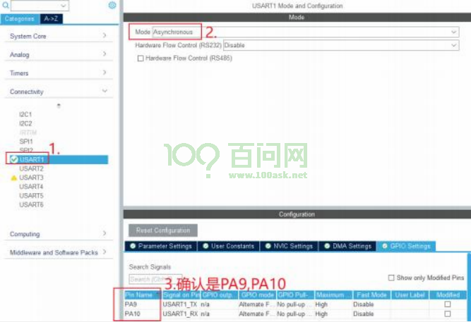 

 然后使能中断：

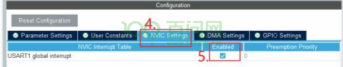 

 在前面STM32H5的UART程序里使用了DMA，本节故意不使用DMA而使用纯中断来 实现UART，多学一种编程方法。

####  2.配置 RS485方向引脚

STM32H5主控板上使用的RS485转换芯片是MAX13487EESA，它会自动切换发送、 接收方向，无需程序进行方向的控制。使用STM32F030制作的“廉价传感器”里，使用 的RS485转换芯片是SIT3088ETK，它需要使用一个GPIO来控制方向，如下图所示：

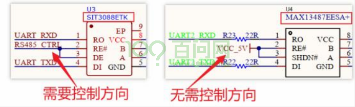 

上图中，RS485_CTRL使用的引脚是PA8，所以还需要把它配置为输出引脚，输出低 电平（让SIT3088ETK默认为接收状态） 。如下配置：

 

### 7.4.2 封装 UART

本节源码为“3_程序源码\01_视频配套的源码\7-5_STM32F030串口编程\demo”。 现场编程。

###  7.4.3 上机实验

本节源码为“3_程序源码\01_视频配套的源码\7-6_STM32F030 串口测试”，里面有 2 个程序：h5_demo、f030_demo。

要测试 STM32F030 的串口， 只需要把它的 485 接口连接到 PC 去就可以了，但是我们没 有 PC 上使用的“USB 转 485”模块，所以使用 STM32H5 来实现一个“USB 转 485 模块”：

- 它从 USB 串口读到数据，再从 485 接口发送出去；

- 它从 485 接口读到数据，再从 USB 串口发送给 PC。

#### 1. 硬件连接

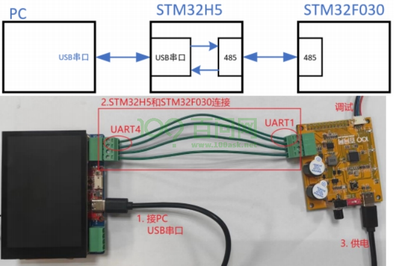 

#### 2. STM32H5 程序改造

本节源码为“3_程序源码\01_视频配套的源码\7-6_STM32F030串口测试\h5_demo”。

#### 3.STM32F030程序调试

本节源码为“3_程序源码\01_视频配套的源码\7-6_STM32F030串口测试\f030_demo”。

## 7.5 libmodbus 移植

本节源码为“3_ 程序源码\01_ 视频配套的源码\7-7_STM32F030 上libmodbus 移植 \f030_demo”。

### 7.5.1 移植 libmodbus

把“7-6_STM32F030串口测试\h5_demo\demo\Middlewares\Third_Party\libmodbus”整 个目录复制到f030_demo中。

在Keil工程中添加代码， 如下：

 

###  7.5.2 使用 modbus 控制设备

STM32F030作为从设备（sever），编写“Core\Src\freertos.c”：

###  7.5.3 上机实验

## 7.6 传感器设计

### 7.6.1 设计思路

上位机（PC 软件）或中控（STM32H5）通过 modbus 协议访问 STM32F030 传感器时，读 写的是 STM32F030 分配出来的 4 个类型的缓冲区。这里需要解决 2 个问题：

-  这 4 个类型的缓冲区起始地址、大小分别是多少？ 这根据传感器的功能来设置。比如有 2 个按键，那么就可以分配 2 个“只读的位寄存器”（DI）。

- 这些寄存器的值， 如何跟硬件对应？ 比如上位机读 DI 寄存器时， 谁提供这些值？传感 器的程序应该读取按键值，填充 DI 寄存器。

第 1 个步骤，被称为“点表设计”。 

### 7.6.2 三款传感器功能及所用引脚

这 3 款传感器的原理图在网盘如下目录里：

 

它们控制外设所用的引脚，列表如下：

|                          | 功能     | 使用的引脚 | 描述                     | 寄存器类别 |
| ------------------------ | -------- | ---------- | ------------------------ | ---------- |
| ENV_MONITOR 环境监测模块 | BEEP1    | PB15       | 高电平发声               | DO         |
|                          | BEEP2    | PB14       | 高电平发声               | DO         |
|                          | LED1     | PB11       | 低电平发光               | DO         |
|                          | LED2     | PB12       | 低电平发光               | DO         |
|                          | LED3     | PB13       | 低电平发光               | DO         |
|                          | OPTO_ADC | PA1        | 电压值跟光强成反比       | AI         |
|                          | RES_ADC  | PA2        | 电压值跟可调电阻成反比   | AI         |
| SWITCH开关量模块         | KEY1     | PA3        | 低电平表示被按下         | DI         |
|                          | KEY2     | PA4        | 低电平表示被按下         | DI         |
|                          | KEY3     | PA5        | 低电平表示被按下         | DI         |
|                          | K1_CTRL  | PB5        | 高电平使能继电器         | DO         |
|                          | K2_CTRL  | PB4        | 高电平使能继电器         | DO         |
|                          | LED1     | PB11       | 低电平发光               | DO         |
|                          | LED2     | PB12       | 低电平发光               | DO         |
|                          | LED3     | PB13       | 低电平发光               | DO         |
| TEMP_HUMI温湿度模块      | BEEP1    | PB15       | 高电平发声               | DO         |
|                          | BEEP2    | PB14       | 高电平发声               | DO         |
|                          | LED1     | PB11       | 低电平发光               | DO         |
|                          | LED2     | PB12       | 低电平发光               | DO         |
|                          | LED3     | PB13       | 低电平发光               | DO         |
|                          | I2C1_SCL | PB6        | 可以读到温度、湿度	AI | AI         |
|                          | I2C2_SDA | PB7        | 可以读到温度、湿度	AI | AI         |

###  7.6.3 点表设计

所谓点表， 就是一个 modbus 设备，它的地址是什么？ 它里面 4 类寄存器的地址、功能 是什么。

在查看点表时，经常碰到“遥测、遥信、遥控、遥调”的概念。它们实质上就是前面 讲解 modbus 时引入的“AI、DI、DO、AO”。这些概念起源于电力系统。

电力领域中四遥系统是指遥测、遥信、遥控、遥调功能系统， 四遥功能是电力监控系 统最基本最重要的功能。具体来说：

- 遥测(遥测信息，AI)：远程测量；远方测量显示诸如电流、电压、功率、压力、温度等 模拟量；

- 遥信(遥信信息，DI)：远程信号；远方监视各类电气开关和设备、机械设备的工作状态 和运转情况状态等；

- 遥控(遥控信息，DO)：远程控制；接受并执行遥控命令，远方控制或保护电气设备及电 气机械化的分合起停等工作状态；

-  遥调(遥调信息，AO)：远程调节；接受并执行遥调命令，远方设定及调整所控设备的工 作参数、标准参数；四遥遥测、遥信、遥控、遥调常常被简称为 AI、DI、DO、AO。

AI、DI、DO、AO 都是英文名称的首字母缩写，A 的英文全称 Analog (模拟量)、D 的英 文全称 Digital (数字量) 、I 的英文全称 Input (输入)、O 的英文全称 Output (输出)。 因此, AI 表示的是模拟信号输出， AO 是模拟信号输入，DI 是数字信号输入， DO 是数字信 号输出。

随着技术不断地进步，现在也有五遥的说法， 即在四遥的基础上加上遥视， 遥视指的 是指利用包括电子技术、计算机技术、自动化技术等监视并记录设备运行情况和环境安全 情况。因此伴随着技术发展， 电力系统中从一遥（遥信 DI）阶段、发展到二遥（遥信 AI、 遥测 DI）、三遥（遥信 AI、遥测 DI 和遥控 DO）、四遥（遥信 AI、遥测 DI、遥控 DO 和遥 调 AO）；现在开始四遥向五遥过渡。

原文链接：https://blog.csdn.net/LuohenYJ/article/details/106027626

在阅读点表时，还会碰到下表中的“PLC/组态地址”，或者表中的简称“0x、1x、4x、 3x”， 它们的本质都是用来分辨“AI、AO、DI、DO”四类寄存器：

| 寄存器种类   | PLC/组态地址 | Modbus 寄存器地址范围 | 简称 | 读写状态 |
| ------------ | ------------ | --------------------- | ---- | -------- |
| 线圈状态     | 00001~09999  | 0000H~FFFFH           | 0x   | 可读可写 |
| 离散输入状态 | ~10001 19999 | 0000H~FFFFH           | 1x   | 只读     |
| 保持寄存器   | 40001~49999  | 0000H~FFFFH           | 4x   | 可读可写 |
| 输入寄存器   | ~30001 39999 | 0000H~FFFFH           | 3x   | 只读     |

点表的设计，是完全由开发人员自行定义的。

#### 1.开关量模块（SWITCH）

寄存器说明：

| 设备地址 | 寄存器地址 | 寄存器类别    | 用途          | 描述     |
| -------- | ---------- | ------------- | ------------- | -------- |
| 01H      | 0000H      | DI            | 读取按键 KEY1 | 1-被按下 |
| 0001H    | DI         | 读取按键 KEY2 | 1-被按下      |          |
| 0002H    | DI         | 读取按键 KEY3 | 1-被按下      |          |
| 0000H    | DO         | 控制继电器 1  | 1-吸合        |          |
| 0001H    | DO         | 控制继电器 2  | 1-吸合        |          |
| 0002H    | DO         | 控制 LED1     | 1-亮          |          |
| 0003H    | DO         | 控制 LED2     | 1-亮          |          |
| 0004H    | DO         | 控制 LED3     | 1-亮          |          |

#### 2. 环境监测模块（ENV_MONITOR）

寄存器说明：

| 设备地址 | 寄存器地址 | 寄存器类别     | 用途                     | 描述 |
| -------- | ---------- | -------------- | ------------------------ | ---- |
| 02H      | 0000H      | DO             | 控制蜂鸣器 1             | 1-响 |
| 0001H    | DO         | 控制蜂鸣器 2   | 1-响                     |      |
| 0002H    | DO         | 控制 LED1      | 1-亮                     |      |
| 0003H    | DO         | 控制 LED2      | 1-亮                     |      |
| 0004H    | DO         | 控制 LED3      | 1-亮                     |      |
| 0000H    | AI         | 读取光敏电压   | 0xfff 对应 3.3V12 位精度 |      |
| 0001H    | AI         | 可调电阻器电压 | 0xfff 对应 3.3V12 位精度 |      |

3. 温湿度模块（TEMP HUMI）

| 设备地址 | 寄存器地址 | 寄存器类别   | 用途                            | 描述 |
| -------- | ---------- | ------------ | ------------------------------- | ---- |
| 03H      | 0000H      | DO           | 控制蜂鸣器 1                    | 1-响 |
| 0001H    | DO         | 控制蜂鸣器 2 | 1-响                            |      |
| 0002H    | DO         | 控制 LED1    | 1-亮                            |      |
| 0003H    | DO         | 控制 LED2    | 1-亮                            |      |
| 0004H    | DO         | 控制 LED3    | 1-亮                            |      |
| 0000H    | AI         | 读取温度     | 单位 0.1 摄氏度 16 位有符号整数 |      |
| 0001H    | AI         | 读取湿度     | 单位 0.1%RH16 位有符合整数      |      |

### 7.6.4 开关量传感器程序设计

继电器原理图如下：

 

继电器对外的信号有 3 个：

-  COM：公共端，通常是中间的触点， 与常开或常闭触点相连
- NC（Normally Closed）： 常闭接口，继电器吸合前与 COM 连接， 吸合后悬空
- NO（Normally Open）： 常开接口， 继电器吸合前悬空， 吸合后与 COM 连接

开路即通路、断路，闭合指的是开关闭合，也就是说， 在没有任何上电之类的动作时， NC 和 COM 端相当于已经连通。

本节源码为“ 3_ 程 序源 码\01_ 视 频配套 的 源 码\7-9_ 开 关 量 传 感 器 程序 设 计 \f030_demo”。

### 7.6.5 环境监测传感器程序设计

#### 1. 硬件电路

光敏电路如下， 光照越强，U6 阻值越低，OPTO_ADC 电压值就越低：

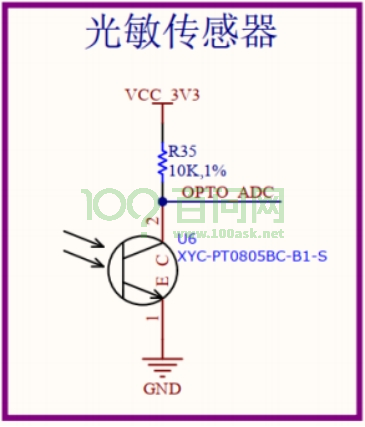 

可调电阻器如下，R33 阻值越大，RES_ADC 电压值越小：

 

 本节源码为“3_ 程序源码\01_ 视频配套的源码\7-10_ 环境监测传感器程序设计 \f030_demo”。

#### 2. 配置 GPIO 和 ADC

先在STM32CubmeMX里配置GPIO和ADC 引脚，使能“Discontinuous Conversion Mode ”：

 

#### 3. 读取 ADC 的关键代码

```c
// 1. 检验
HAL_ADCEx_Calibration_Start(&hadc) ;

// 启动、读2次数值
for (int i = 0; i < 2; i++)
{
    HAL_ADC_Start(&hadc);
    if (HAL_OK == HAL_ADC_PollForConversion(&hadc, 100))
    {
    	mb_mapping->tab_input_registers[i] = HAL_ADC_GetValue(&hadc); 
    }
}
```

###  7.6.6 温湿度传感器程序设计

本节源码为“ 3_ 程序源码\01_ 视频配套 的源码\7-11_ 温湿度传感器程序设计 \f030_demo”。

#### 1. 硬件电路与操作方法

原理图如下：

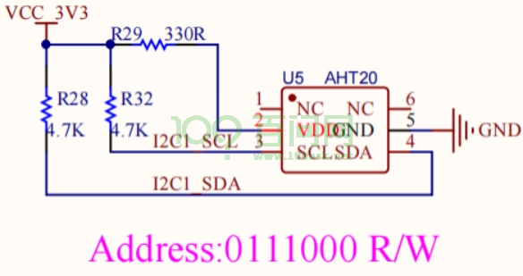 

 AHT20 芯片资料在网盘如下目录：

 

 AHT20 操作方法如下：

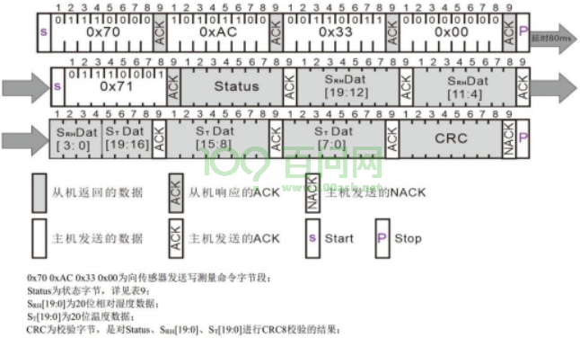 

详解如下：

-  发送测量命令：传感器的 VDD 上电后需等待 5ms， 发送写测量命令 0x70 0xAC 0x330x00， 等待 80ms 测量完成；
-  获取温湿度校准数据： 在等待 80ms 测量完成后， 发送 0x71 读传感器，可获取状态字 Status、温湿度校准数据 SRH[19:0]、ST[19:0]以及校准字 CRC；
- 根据公式计算温湿度：

 

 计算检验码的函数如下：

```c
//**********************************************************//
//CRC校验类型：  CRC8
//多项式：  X8+X5+X4+1
//Poly:0011 0001 0x31
unsigned char Calc_CRC8(unsigned char *message,unsigned char Num)
{
    unsigned char i;
    unsigned char byte;
    unsigned char crc =0xFF;
    for (byte = 0;byte<Num;byte++)
    {
        crc^=(message[byte]);
        for(i=8;i>0;--i)
        {
            if(crc&0x80)
            crc=(crc<<1)^0x31;
            else
            crc=(crc<<1);
        }
    }
    return crc;
}//
**********************************************************//
```

#### 2. 配置 I2C

  

#### 3. 读取温湿度关键代码

读取一次温湿度值， 耗时至少 80ms。不可能在接收到modbus 请求后再去读温湿度。而 是使用另一个任务不断读取温湿度。

```c
HAL_StatusTypeDef HAL_I2C_Master_Transmit(I2C_HandleTypeDef *hi2c, uint16_t DevAddress, uint8_t *pData, uint16_t Size, uint32_t Timeout) ;

HAL_StatusTypeDef HAL_I2C_Master_Receive(I2C_HandleTypeDef *hi2c, uint16_t DevAddress, uint8_t *pData, uint16_t Size, uint32_t Timeout) ;
```

## 7.7 访问多个传感器

如下图连线，H5控制板使用USB线供电，中间的HUB也使用USB供电：

 

连接示意图为：

 

**注意**：三个传感器的启动开关都拨到“ON”位置。

### 7.7.1 主控访问多个传感器

本节源码为“3_程序源码\01_视频配套的源码\7-12_主控访问多个传感器\h5_demo、f030_demo”。

注意：f030_demo需要分别设置下面的宏（这3个宏同一时间只能定义一个），编译出程序后分别烧写到3个传感器里。

```c
#define USE_SWITCH_SENSOR 1
#define USE_ENV_MONITOR_SENSOR 1
#define USE_TMP_HUMI_SENSOR 1
```

编写H5主控程序，为每个485通道创建一个任务，任务里创建modbus结构体：

- 任务1：使用CH1，访问开关量传感器、环境监测传感器，在LCD上显示数据
- 任务2：使用CH2，访问温湿度传感器，在LCD上显示数据

注意：因为任务1、任务2都访问LCD，在LCD函数里要加入互斥措施，否则LCD会花屏。

### 7.7.2 上位机访问多个传感器

本节源码为“3_程序源码\01_视频配套的源码\7-13 上位机访问多个传感器\h5_demo、f030_demo”。

注意：f030_demo需要分别设置下面的宏（这3个宏同一时间只能定义一个），编译出程序后分别烧写到3个传感器里。

```c
#define USE_SWITCH_SENSOR 1
#define USE_ENV_MONITOR_SENSOR 1
#define USE_TMP_HUMI_SENSOR 1
```

在上位机的角度，它只看到H5主控板一个Modbus设备。上位机怎么去访问接在H5上的其他3个传感器？这里需要进行“映射”：上位机读写H5的某个寄存器，其实是去读写某个传感器。

本节使用一个固定的映射点表，如下：

| H5设备地址 | H5寄存器地址 | H5寄存器类别     | 映射                               | 用途                        | 描述     |
| ---------- | ------------ | ---------------- | ---------------------------------- | --------------------------- | -------- |
| 01H        | 0000H        | DI               | CH1ID=1DI寄存器0                   | 读取开关量传感器的按键KEY1  | 1-被按下 |
| 0001H      | DI           | CH1ID=1DI寄存器1 | 读取开关量传感器的按键KEY2         | 1-被按下                    |          |
| 0002H      | DI           | CH1ID=1DI寄存器2 | 读取开关量传感器的按键KEY3         | 1-被按下                    |          |
| 0000H      | DO           | H5的LED          | 控制H5的LED                        | 1-亮                        |          |
| 0001H      | DO           | CH1ID=1DO寄存器0 | 控制开关量传感器的继电器1          | 1-吸合                      |          |
| 0002H      | DO           | CH1ID=1DO寄存器1 | 控制开关量传感器的继电器2          | 1-吸合                      |          |
| 0003H      | DO           | CH1ID=1DO寄存器2 | 控制开关量传感器的LED1             | 1-亮                        |          |
| 0004H      | DO           | CH1ID=1DO寄存器3 | 控制开关量传感器的LED2             | 1-亮                        |          |
| 0005H      | DO           | CH1ID=1DO寄存器4 | 控制开关量传感器的LED3             | 1-亮                        |          |
| 0006H      | DO           | CH1ID=2DO寄存器0 | 控制环境监测传感器的蜂鸣器1        | 1-响                        |          |
| 0007H      | DO           | CH1ID=2DO寄存器1 | 控制环境监测传感器的蜂鸣器2        | 1-响                        |          |
| 0008H      | DO           | CH1ID=2DO寄存器2 | 控制环境监测传感器的LED1           | 1-亮                        |          |
| 0009H      | DO           | CH1ID=2DO寄存器3 | 控制环境监测传感器的LED2           | 1-亮                        |          |
| 000AH      | DO           | CH1ID=2DO寄存器4 | 控制环境监测传感器的LED3           | 1-亮                        |          |
| 000BH      | DO           | CH2ID=3DO寄存器0 | 控制温湿度传感器的蜂鸣器1          | 1-响                        |          |
| 000CH      | DO           | CH2ID=3DO寄存器1 | 控制温湿度传感器的蜂鸣器2          | 1-响                        |          |
| 000DH      | DO           | CH2ID=3DO寄存器2 | 控制温湿度传感器的LED1             | 1-亮                        |          |
| 000EH      | DO           | CH2ID=3DO寄存器3 | 控制温湿度传感器的LED2             | 1-亮                        |          |
| 000FH      | DO           | CH2ID=3DO寄存器4 | 控制温湿度传感器的LED3             | 1-亮                        |          |
| 0000H      | AI           | CH1ID=2AI寄存器0 | 读取环境监测传感器的光敏电压       | 0xfff对应3.3V12位精度       |          |
| 0001H      | AI           | CH1ID=2AI寄存器1 | 读取环境监测传感器的可调电阻器电压 | 0xfff对应3.3V12位精度       |          |
| 0002H      | AI           | CH2ID=3AI寄存器0 | 读取温湿度传感器的温度             | 单位0.1摄氏度16位有符号整数 |          |
| 0003H      | AI           | CH2ID=3AI寄存器1 | 读取温湿度传感器的湿度             | 单位0.1%RH16位有符合整数    |          |

编写H5主控程序：

- 任务1：创建一个Modbus设备，分配modbus_mapping_t，读取PC发来的请求并进行回应
- 任务2：使用CH1访问开关量传感器（ID=1），在modbus_mapping_t和传感器之间传递数据。
- 任务3：使用CH1访问环境监测传感器（ID=2），在modbus_mapping_t和传感器之间传递数据。
- 任务4：使用CH2访问温湿度传感器（ID=3），在modbus_mapping_t和传感器之间传递数据。

程序框图如下图所示：

 

## 7.8 程序改进

### 7.8.1 主控UART代码的更好封装

本节源码为“3_程序源码\01_视频配套的源码\7-14_主控UART代码的更好封装\h5_demo、f030_demo”。

对于同一款芯片上面的多个UART，它们的操作代码是类似的，没有必要为各个UART单独提供函数，如下代码有改进空间：

```c
struct UART_Device g_uart2_dev = {"uart2", UART2_Rx_Start, UART2_Send, UART2_GetData, UART2_Flush};
struct UART_Device g_uart4_dev = {"uart4", UART4_Rx_Start, UART4_Send, UART4_GetData, UART4_Flush};
```

以UART2_Rx_Start、UART4_Rx_Start为例，它们的代码如下：

 

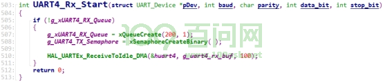 

它们的功能是类似的，可以使用同一套函数UART_Rx_Start，关键是：

- 如何分辨它要操作哪个UART？只能在第1个参数里进行分辨
- 如何记录创建的队列、信号量？最好存在第1个参数里

所以，需要对UART_Device结构体进行扩展，添加“私有数据”，如下：

```c
typedef struct UART_Device {
      char *name;
      int (*Init)( struct UART_Device *pDev, int baud, char parity, int data_bit, int stop_bit);
      int (*Send)( struct UART_Device *pDev, uint8_t *datas, uint32_t len, int timeout);
      int (*RecvByte)( struct UART_Device *pDev, uint8_t *data, int timeout);
      int (*Flush)(struct UART_Device *pDev);
      void *priv_data;
}UART_Device, *PUART_Device;
```

上述“priv_data”将指向设备相关的结构体，比如：

```c
#define RX_BUF_LEN 1000
typedef struct UART_Data {

      UART_HandleTypeDef *huart;
      SemaphoreHandle_t txSemaphore;
      QueueHandle_t rxQueue;
      uint8_t rx_buf[RX_BUF_LEN];

}UART_Data, *PUART_Data;

static struct UART_Data g_uart1_data = {
      &huart1,
};

static struct UART_Data g_uart2_data = {
      &huart2,
};

static struct UART_Data g_uart4_data = {
      &huart4,
};
```

然后，就可以如此实现函数了：

```C
UART_Device g_uart1_dev = {"uart1", UART_Rx_Start, UART_Send, UART_GetData, UART_Flush, &g_uart1_data};
UART_Device g_uart2_dev = {"uart2", UART_Rx_Start, UART_Send, UART_GetData, UART_Flush, &g_uart2_data};
UART_Device g_uart4_dev = {"uart4", UART_Rx_Start, UART_Send, UART_GetData, UART_Flush, &g_uart4_data};

int UART_Rx_Start(PUART_Device pDev, int baud, char parity, int data_bit, int stop_bit)
{
    PUART_Data data = pDev->priv_data;
      
	if (!data->rxQueue)
      {
		data->rxQueue = xQueueCreate(200, 1);
		data->txSemaphore = xSemaphoreCreateBinary();
		
		HAL_UARTEx_ReceiveToIdle_DMA(data->huart, data->rx_buf, RX_BUF_LEN);
		//HAL_UARTEx_ReceiveToIdle_IT(data->huart, data->rx_buf, 1);
      }
      return 0;
}
```

### 7.8.2 增加容错代码

本节源码为“3_程序源码\01_视频配套的源码\7-15_增加容错代码\h5_demo、f030_demo”。

#### **1. 添加UART错误恢复代码**

无论是主控程序还是传感器程序，使用UART进行数据传输是本项目的关键。如果发生了UART错误，应该能从错误中恢复。

在错误中断回调函数里，重新初始化UART、重新启动数据接收，代码如下：

```C
void HAL_UART_ErrorCallback(UART_HandleTypeDef *huart)
{
      PUART_Data data = NULL;

      if (huart == &huart1)
      {
        data = &g_uart1_data;
      }

      if (huart == &huart2)
      {
        data = &g_uart2_data;
      }

      if (huart == &huart4)
      {
        data = &g_uart4_data;
      }

      if (data)
      {
        HAL_UART_DeInit(data->huart);
        HAL_UART_Init(data->huart);
	
        /* re-start DMA+IDLE rx */
        HAL_UARTEx_ReceiveToIdle_DMA(data->huart, data->rx_buf, RX_BUF_LEN);
        //HAL_UARTEx_ReceiveToIdle_IT(data->huart, data->rx_buf, 1);
      }
}
```

#### **2. 调整libmodbus的超时时间**

如下修改“Middlewares\Third_Party\libmodbus\modbus-private.h”：

```C
#define _RESPONSE_TIMEOUT 10000
#define _BYTE_TIMEOUT   10000
```

#### **3. 主控发出libmodbus请求的间隔加大**

获得锁之后，等待一会再发送Modbus请求，以便让从机超时退出并进入新一轮的等待：

 